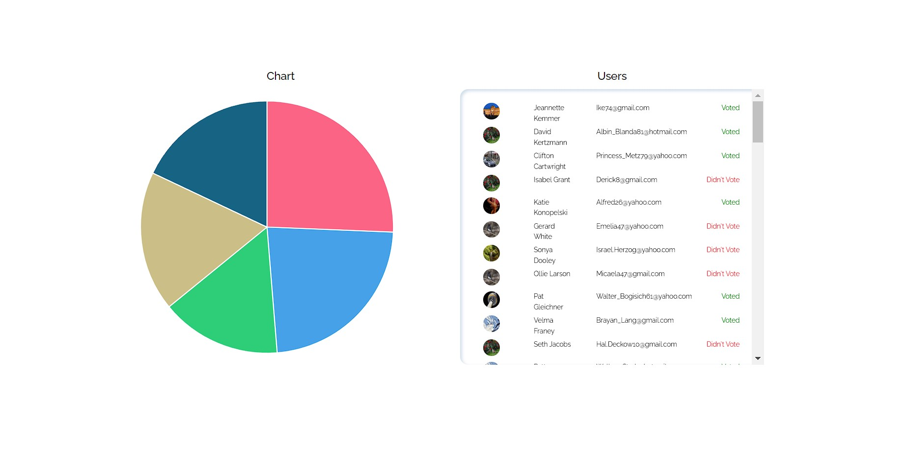

# College Elections Voting App

[Features](#features) | [Login Details](#login-details) | [Project Structure](#project-structure) | [Images](#images) | [Technologies](#technologies) | [Usage](#usage) | [License](#license)

The College Elections Voting App is a web application developed as part of a weekend bootcamp task. It allows users to vote in a college election and provides an admin dashboard to manage and view election results.

## Features

- **User Authentication:** Secure login for users and admin.
- **Voting System:** Users can vote for one of five candidates.
- **Admin Dashboard:** Admins can view a list of users and see a graphical representation of voting results.

## Login Details

1. **Admin User**  
   - **Email:** Ike74@gmail.com  
   - **Password:** j9TU3qYoqGFnecx  

2. **Regular User**  
   - **Email:** Alfred26@yahoo.com  
   - **Password:** 8qKLzxc6gMGA_cw  

3. **User Who Has Not Voted**  
   - **Email:** Israel.Herzog@yahoo.com  
   - **Password:** VEs021ROjOLqSb3

## Project Structure

- **LoginPage:** Handles authentication and redirects based on user role.
- **UserPage:** Voting interface for regular users.
- **AdminPage:** Overview of users and voting results, with a pie chart for admins.

## Images

## Technologies Used

- **Frontend:** React
- **Routing:** React Router
- **Styles:** CSS
- **Data:** Mock API

## Usage

1. **Login:** Users log in with their credentials; admins access additional features.
2. **Vote:** Users select their preferred candidate.
3. **Admin Dashboard:** Admins view user lists and voting results.

## License

This project is licensed under the MIT License - see the [LICENSE](LICENSE) file for details.

## Contact

For any questions or suggestions, feel free to contact me at [abelartur.mail@gmail.com](mailto:abelartur.mail@gmail.com).

